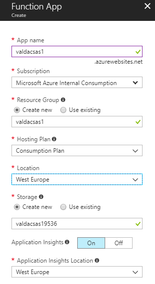
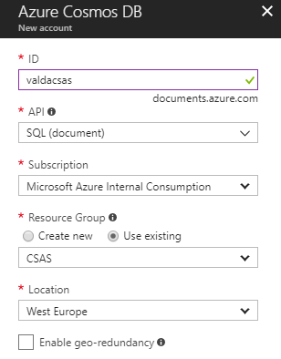

# Create infrastructure for API hackathon

For our examples we will need Azure Function App and Azure Cosmos DB created in your Azure subscription.

### Step 1: Create Azure Function App
In Azure Portal create new resource "Function App" in new resource group in your favourite region. You have to select unique name for Function App service, select hosting plan "Consumption Plan" and enable "Application Insights" for service. See picture:

### Step 2: Create Azure Cosmos DB
In Azure Portal create Azure Cosmos DB in same resource group as Azure Function App. Use unique name for Cosmos DB service, also use "SQL (document)" API. See picture:

