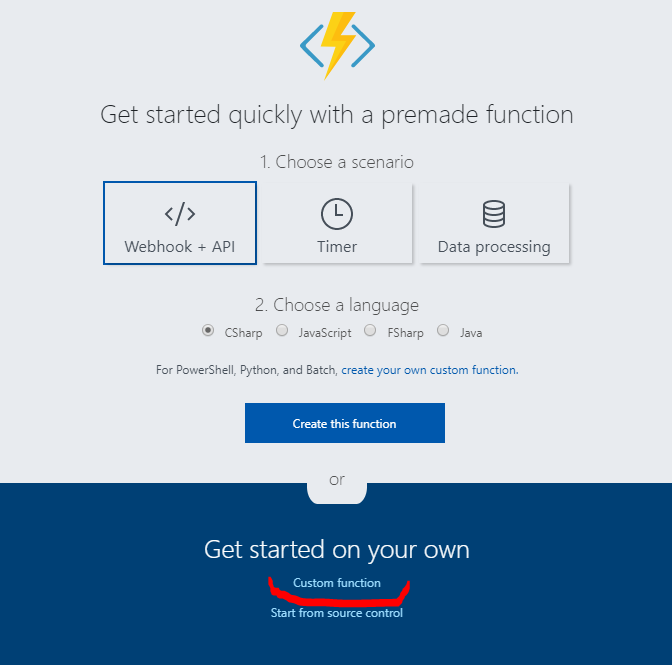

# Simple REST API interface in Azure Function App

Aim of this experiment is to create simple REST API which exposes functionality to create new ToDo item, ToDo items are stored in docuemnt oriented database (in our case Cosmos DB). Function itself uses JavaScript programming language.

Our solution is using this JSON data structure:
```json
{
    "id": "xxxxxxxx-xxxx-4xxx-yxxx-xxxxxxxxxxxx",
    "created": "yyyy-MM-dd",
    "updated": "yyyy-MM-dd",
    "category": "",
    "comment": ""
}
```

Before we will start we need working (deployed) Function App service and Azure Cosmos DB (with SQL interface).

### Step 1: create new function
In Azure portal select your Function App. In the left pane of control plane screen select "plus" symbol just on right side of "Function" section.


Then lets select link "Custom function" in welcome screen.



In configuration oage select from "Language" drop down list "Javascript" and from offered templates select "HttpTrigger - JavaScript".


Define name `ToDoAdd` like a name for your function and hit button "Create".


### Step 2: integrate function with Azure Cosmos DB

Function is created. Then we can continue to "Integrate" option belongs to function `ToDoAdd` and there click on right side of configuration screen on "New Output".


From the offered integration possibilities select "Azure Cosmos DB" and hit button "Select".


In output binding definition dialogue define names for:
* leave Document parameter name on `outputDocument`
* Database name - yocan put there you rname or leave `outDatabase`
* Collection name - define your own or use default `MyCollection`
* Check option "If true, creates te Azure Cosmos DB database and collection"
* Finally select your "Azure Cosmos DB account connection"

Save your options by "Save" button.


### Step 3: Create function body and test it

Now we have to go back to function body by clicking function name in left pane of Function App configuration screen.

Copy this function body to our function:

```javascript
module.exports = function(context, req) {
    context.log('JavaScript HTTP trigger function processed a request.');

    if (req.body) {
        context.bindings.outputDocument = {
            id: 'xxxxxxxx-xxxx-4xxx-yxxx-xxxxxxxxxxxx'.replace(/[xy]/g, function(c) {
                var r = Math.random() * 16 | 0,
                    v = c == 'x' ? r : r & 0x3 | 0x8;
                return v.toString(16);
            }),
            created: new Date(),
            updated: new Date(),
            category: req.body.category,
            comment: req.body.comment
        }

        context.res = {
            // status: 200, /* Defaults to 200 */
            body: "Todo item created with id: " + context.bindings.outputDocument.id
        };
    } else {
        context.res = {
            status: 400,
            body: "Insufficient parameters!"
        };
    }
    context.done();
};
```
Hit "Save" button. And than "Run" button.

Now copy to right part of screen to field "Request body" your testing JSON data, for example:

```json
{
    "category": "Azure",
    "comment": "comment ..."
}
```
You can hit few times "Run" button and observe in "Logs" output window and "Output" window what happens. Data should be stored in Cosmos DB now (also we can check via Cosmos DB data explorer in Azure portal that data was inserted to database.


