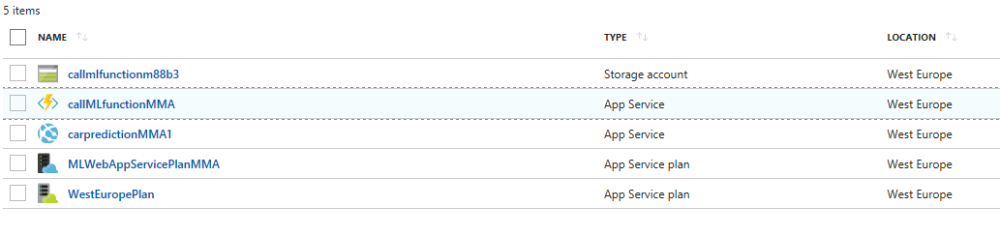

- This is preview file for Machine Learning part of Hackathon.

# Machine Learning - model consume with Function App (15min hack)

This experiment demonstrate how to create a Azure Machine Learning experiment, turn it to Predictive Web Service and consume via Function App in fast and easy way! 

> Prerequisities:
- Azure Subscrption
- Machine Learning Workspace
- Machine Learning Web Service Plan

We have prepared most of the enviroment for you for fast and simple start - check you environment, an Azure resource group, looks like this:




```json
{adsf}
```

```javascript
module.exports = function(context, req) {
}
```


### Step 1: create new function