# Machine Learning - model consume with Function App

This experiment demonstrate how to create a Azure Machine Learning experiment, turn it to Predictive Web Service and consume via Function App in fast and easy way! 

Business case: 
Everybody knows famous Titanic voyage and the consequences. In this hackathon you will make a Machine Learning experiment that takes Titanic passenger data and predicts whether somebody would survive or not based on features of the passenger.

> Prerequisities:
> - Azure Subscrption
> - [Machine Learning Workspace](https://docs.microsoft.com/en-us/azure/machine-learning/studio/walkthrough-1-create-ml-workspace "")
> - [Machine Learning Web Service Plan](https://docs.microsoft.com/en-us/azure/machine-learning/studio/publish-a-machine-learning-web-service#deploy-it-as-a-web-service)

We have prepared most of the enviroment for you for fast and simple start - check you environment, an Azure resource group, looks like this:


### Step 1: Create / Deploy Machine Learing experiment
You can try to get inspiration from varius sources - one of them would be https://gallery.cortanaintelligence.com there is particular experiment we will benefit from:
- https://gallery.cortanaintelligence.com/Experiment/Titanic-Survivor-Predictor-1

Choose "Open in Studio" from the right side to deploy experiment into your Machine Learning Workspace (when prompted select the right workspace):

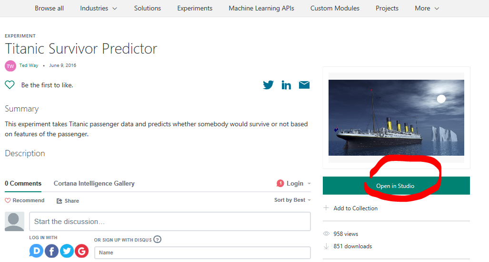

> Optional - Investigate experiment
> You can see a pretty basic Machine Learning classification experiment. There is a few steps of data preparation - select only relevant columns, transfrming categorical variables, clean missing data, etc.

Run the experiment (see previous image) and Evaluate model to see the output and precision - righ-click on the last module output pin and choose visualize:

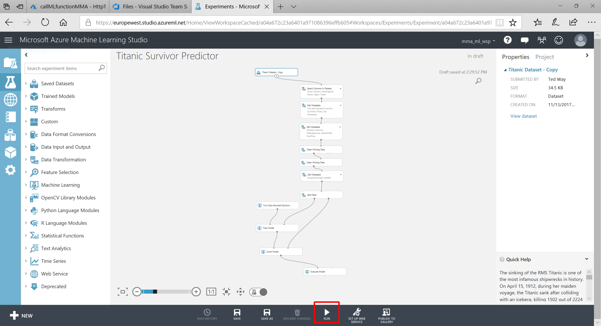

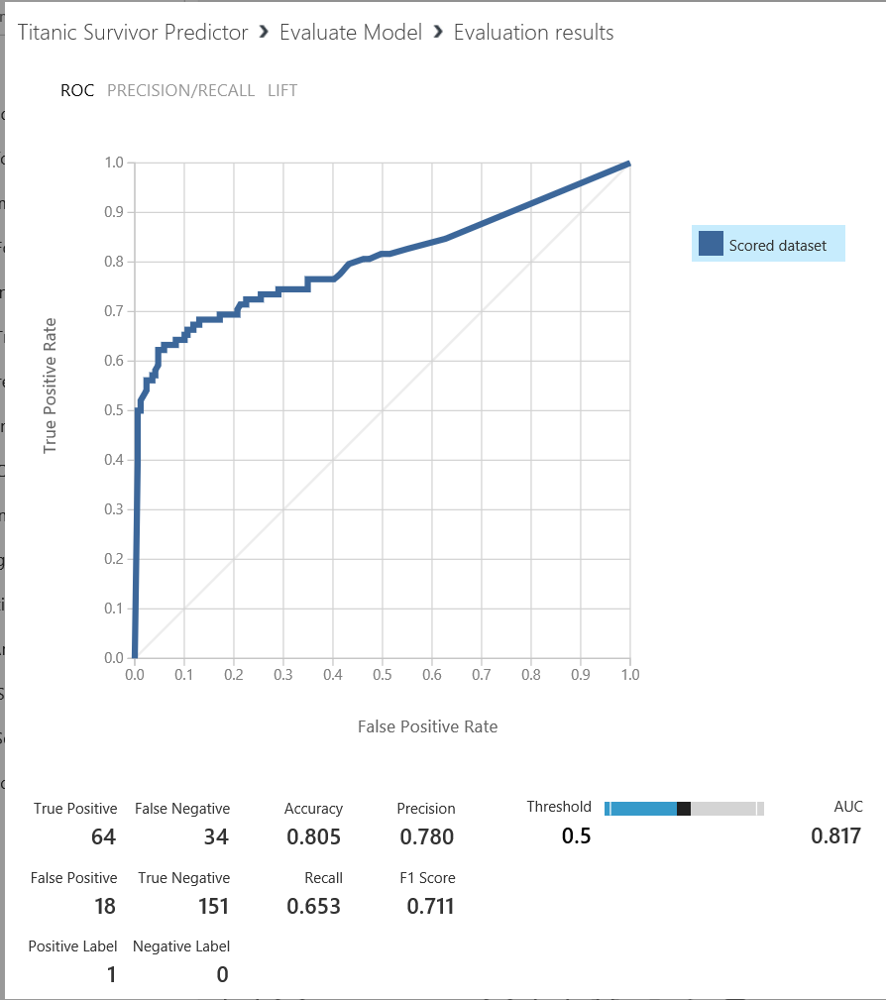

### Step 2: Create Predictive Webservice

Deploy experiment as Predictive Web Service - first turn into Predictive Experiment (to set up web services input and outputs)

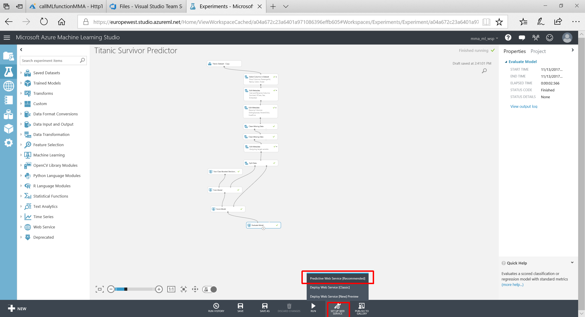

Now rewire the Webservice input to the Score module (since we don't need to do data prep anymore) and on the Score module uncheck the "Append score colmumns" (as we need only the scored labels column - the prediction only)

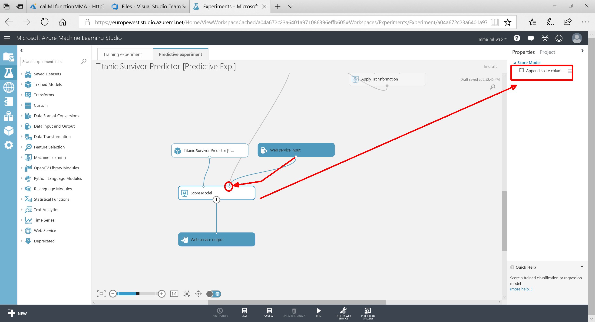

Run the experiment once again (to apply ) changes and Deploy as Webservice:

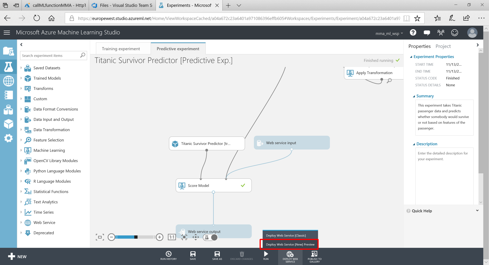

Choose valid ML Web Service plan (the billing goes towards this plan):

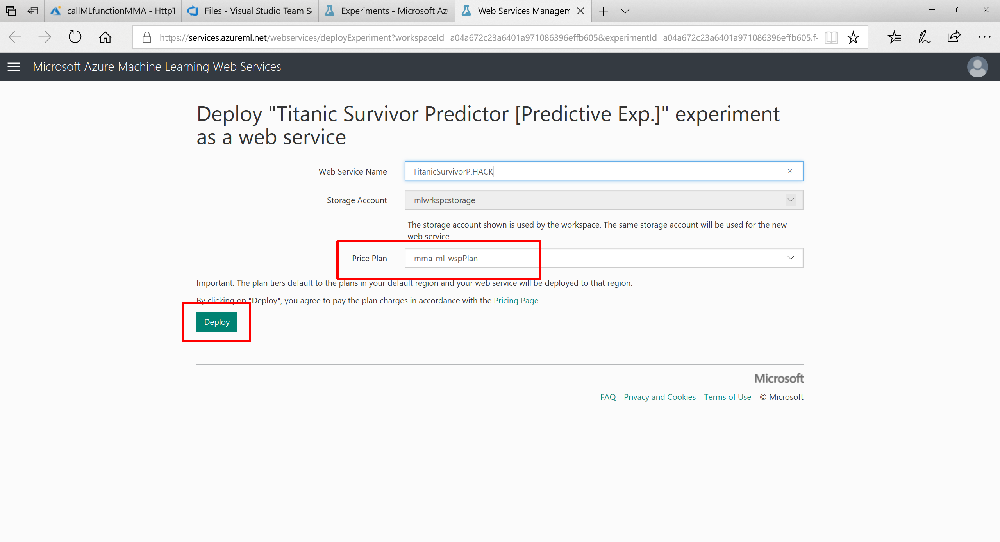

Once the Web Service is deployed you should be able to acces details as API endpoint URI and key to access the Webservices - you will use them later in the Function App.

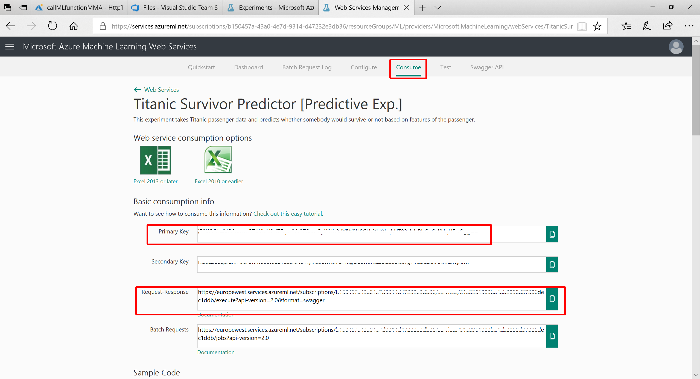


### Step 3: Create new Function App
In Azure portal select your Function App. In the left pane of control plane screen select "plus" symbol just on right side of "Function" section.

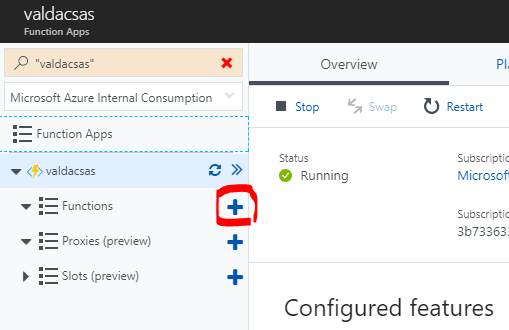

Then lets select link "Custom function" in welcome screen.

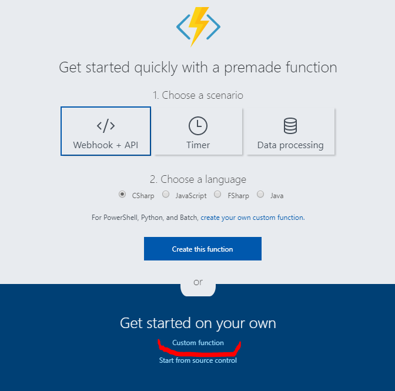

Create a HTTP Triggered C# function:

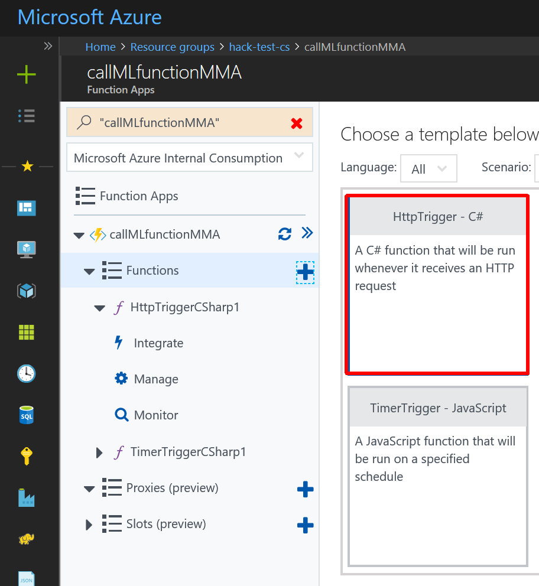


Insert the code to the function and take a look on these areas and change appropriatelly (endpoint and key form previous section):

https://github.com/valda-z/funcapp-hackathon/blob/master/Machine_Learning/assets/http_ML_call_function.cs

```javascript
  const string apiKey = "### YOUR_KEY ###"; // Replace this with the API key for the web service
    client.DefaultRequestHeaders.Authorization = new AuthenticationHeaderValue( "Bearer", apiKey);
    client.BaseAddress = new Uri("### YOUR_URI ###");

```


The function takes a JSON input with parameters for Webservice to make predictions:

Input / Request Body
```json
{
    "PassengerClass": "1",
    "Gender": "female",
    "Age": "22"
}
```

You can use those above and/or change with your values to reflect changes and to see if you would have survived the Titanic voyage.

When you hit Run (or Save and Run) you should see also the response which is the prediction for your particular parameters. Result values:
- Survived - IGNORE THIS - dummy column just for compatibility
- Scored Labels - prediction if the passenger survived (1) or not (0)
- Probabilities - classification probability from alghorithm 

Output:
```json
"{"Results":{"output1":[{"Survived":"-1","Scored Labels":"1","Scored Probabilities":"0.999785125255585"}]}}"
```

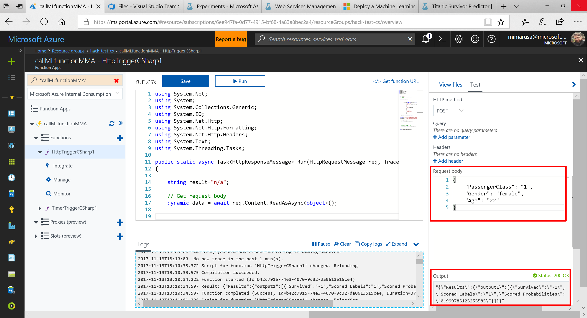

The whole function code looks like this: (file: xxx)

```javascript
using System.Net;
using System;
using System.Collections.Generic;
using System.IO;
using System.Net.Http;
using System.Net.Http.Formatting;
using System.Net.Http.Headers;
using System.Text;
using System.Threading.Tasks;

public static async Task<HttpResponseMessage> Run(HttpRequestMessage req, TraceWriter log)
{
    
    string result="n/a";

    // Get request body
    dynamic data = await req.Content.ReadAsAsync<object>();

    
    using (var client = new HttpClient())
{
    var scoreRequest = new
    {
        Inputs = new Dictionary<string, List<Dictionary<string, string>>> () {
            {
                "input1",
                new List<Dictionary<string, string>>(){new Dictionary<string, string>(){
                                {
                                    "Survived", "-1"
                                },
                                {
                                    "PassengerClass", data.PassengerClass.ToString()
                                },
                                {
                                    "Gender", data.Gender.ToString()
                                },
                                {
                                    "Age", data.Age.ToString()
                                },
                                {
                                    "SiblingSpouse", "1"
                                },
                                {
                                    "ParentChild", "0"
                                },
                                {
                                    "FarePrice", "7.25"
                                },
                                {
                                    "PortEmbarkation", "S"
                                },
                    }
                }
            },
        },
        GlobalParameters = new Dictionary<string, string>() {
        }
    };

    const string apiKey = "### YOUR_KEY ###"; // Replace this with the API key for the web service
    client.DefaultRequestHeaders.Authorization = new AuthenticationHeaderValue( "Bearer", apiKey);
    client.BaseAddress = new Uri("### YOUR_URI ###");


    HttpResponseMessage response = await client.PostAsJsonAsync("", scoreRequest);

    if (response.IsSuccessStatusCode)
    {
        result = await response.Content.ReadAsStringAsync();
        log.Info("SUCCESS! Result: " + result);
    }
    else
    {
        log.Info(string.Format("The request failed with status code: {0}", response.StatusCode));

        // Print the headers - they include the requert ID and the timestamp,
        // which are useful for debugging the failure
        log.Info(response.Headers.ToString());

        string responseContent = await response.Content.ReadAsStringAsync();
        log.Info(responseContent);
    }
}


   return req.CreateResponse(HttpStatusCode.OK, result);

}

```
