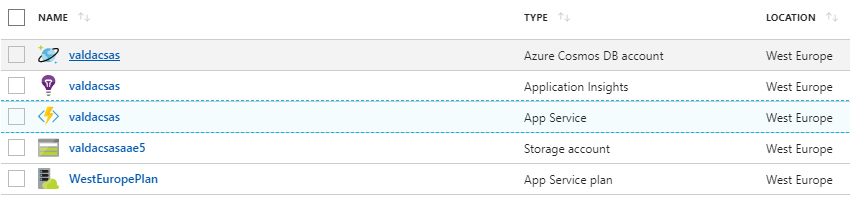

# API hackathon

Experiment's prerequisites are described in this Readme file: https://github.com/valda-z/funcapp-hackathon/blob/master/Assets/README.md .

Experiments with APIs are divided to two separates areas (Azure Function Apps experiment and Machine Learning API experiment).

### Azure Function App experiment

Contains two steps guideline describing REST API created in Function App:
* First experiment: Create simple REST API interface which will create new "ToDo" item in connected Azure Cosmos DB (document database). Description of steps: https://github.com/valda-z/funcapp-hackathon/blob/master/FunctionApp_REST/README.md
* Second experiment: Create Single Page Application and extend REST API interface which will list ToDo items and create new "ToDo" item in connected Azure Cosmos DB (document database). Description of steps: https://github.com/valda-z/funcapp-hackathon/blob/master/FunctionApp_SinglePage/README.md

### Machine Learning API experiment